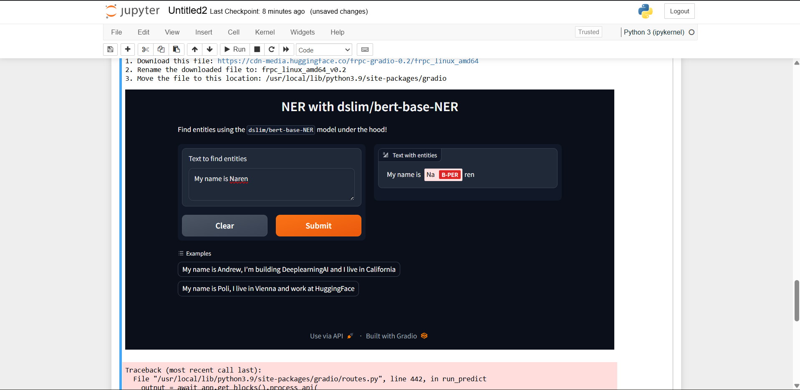

## Development of a Named Entity Recognition (NER) Prototype Using a Fine-Tuned BART Model and Gradio Framework

### AIM:
To design and develop a prototype application for Named Entity Recognition (NER) by leveraging a fine-tuned BART model and deploying the application using the Gradio framework for user interaction and evaluation.

### PROBLEM STATEMENT:
Named Entity Recognition (NER) is an important Natural Language Processing (NLP) task used to identify and classify entities such as person names, organizations, and locations from unstructured text. Traditional text-processing systems face difficulty in automatically extracting such information efficiently from large volumes of text data.
The objective of this experiment is to develop a web-based NER prototype using a fine-tuned transformer model hosted through the HuggingFace Inference API and deploy the system using the Gradio framework. The application should accept user text input, process it through the NER model, and visually highlight the identified entities.

## DESIGN STEPS:
### STEP 1:
Import the required libraries, load the HuggingFace API key from the environment variables, and create a helper function to access the HuggingFace inference endpoint.

### STEP 2:
Create the Named Entity Recognition function that sends user input to the HuggingFace NER model endpoint and retrieves the detected entities.

### STEP 3:
Develop and launch an interactive Gradio-based user interface for accepting user text input and displaying highlighted named entities.

PROGRAM:
```
import os
import io
from IPython.display import Image, display, HTML
from PIL import Image
import base64

from dotenv import load_dotenv, find_dotenv

_ = load_dotenv(find_dotenv())

hf_api_key = os.environ['HF_API_KEY']


# Helper Function

import requests
import json


# HuggingFace API Helper Function

def get_completion(
    inputs,
    parameters=None,
    ENDPOINT_URL=os.environ['HF_API_SUMMARY_BASE']
):

    headers = {
        "Authorization": f"Bearer {hf_api_key}",
        "Content-Type": "application/json"
    }

    data = {
        "inputs": inputs
    }

    if parameters is not None:
        data.update({"parameters": parameters})

    response = requests.request(
        "POST",
        ENDPOINT_URL,
        headers=headers,
        data=json.dumps(data)
    )

    return json.loads(
        response.content.decode("utf-8")
    )


# NER Endpoint

API_URL = os.environ['HF_API_NER_BASE']


# Sample Input

text = (
    "My name is Andrew, "
    "I'm building DeepLearningAI "
    "and I live in California"
)

get_completion(
    text,
    parameters=None,
    ENDPOINT_URL=API_URL
)


# Import Gradio

import gradio as gr


# Named Entity Recognition Function

def ner(input):

    output = get_completion(
        input,
        parameters=None,
        ENDPOINT_URL=API_URL
    )

    return {
        "text": input,
        "entities": output
    }


# Close Existing Gradio Instances

gr.close_all()


# Create Gradio Interface

demo = gr.Interface(

    fn=ner,

    inputs=[
        gr.Textbox(
            label="Text to find entities",
            lines=2
        )
    ],

    outputs=[
        gr.HighlightedText(
            label="Text with entities"
        )
    ],

    title="NER with dslim/bert-base-NER",

    description="""
Find entities using the
dslim/bert-base-NER model
under the hood!
""",

    allow_flagging="never",

    examples=[
        "My name is Andrew and I live in California",

        "My name is Poli and work at HuggingFace"
    ]
)


# Launch Application

demo.launch(
    share=True,
    server_port=int(os.environ['PORT3'])
)
```

### OUTPUT:




### RESULT:
Thus, the Named Entity Recognition (NER) prototype was successfully developed using the HuggingFace Inference API and Gradio framework. The application successfully identified and highlighted named entities such as persons and locations from input text through an interactive web-based interface.